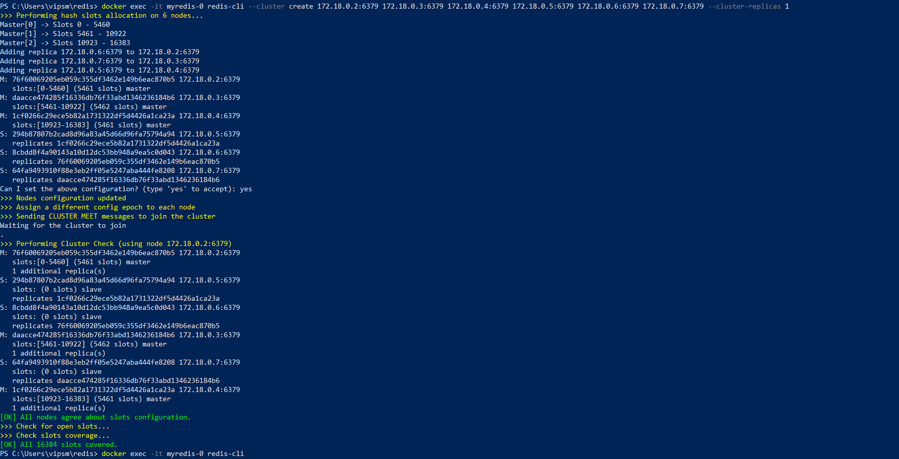
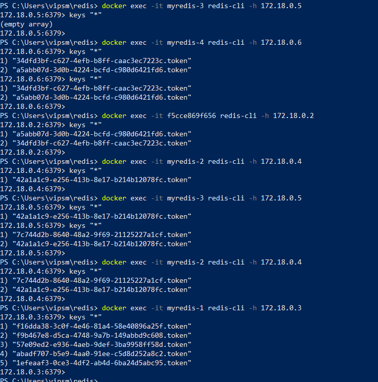

To start Redis cluster <br />
---
Create folders 7000, 7001, 7002, 7003, 7004, 7005 <br />
````
  mkdir 7000, 7001, 7002, 7003, 7004, 7005
````
put redis.conf file in each folder. The content is
````
port 6379
cluster-enabled yes
cluster-config-file nodes.conf
cluster-node-timeout 5000
appendonly yes
bind <ip>
````
per example 
````
port 6379
cluster-enabled yes
cluster-config-file nodes.conf
cluster-node-timeout 5000
appendonly yes
bind 172.18.0.2
````
ip is different per redis instance.

Create docker network <br />
---
````
docker network create spring-redis-network
````
Run containers
---
````
docker run --net spring-redis-network -v <fullpath>/7000/redis.conf:/usr/local/etc/redis/redis.conf -p 7000:6379 -d --name myredis-0 redis redis-server /usr/local/etc/redis/redis.conf
docker run --net spring-redis-network -v <fullpath>/7001/redis.conf:/usr/local/etc/redis/redis.conf -p 7001:6379 -d --name myredis-1 redis redis-server /usr/local/etc/redis/redis.conf
docker run --net spring-redis-network -v <fullpath>/7002/redis.conf:/usr/local/etc/redis/redis.conf -p 7002:6379 -d --name myredis-2 redis redis-server /usr/local/etc/redis/redis.conf
docker run --net spring-redis-network -v <fullpath>/7003/redis.conf:/usr/local/etc/redis/redis.conf -p 7003:6379 -d --name myredis-3 redis redis-server /usr/local/etc/redis/redis.conf
docker run --net spring-redis-network -v <fullpath>/7004/redis.conf:/usr/local/etc/redis/redis.conf -p 7004:6379 -d --name myredis-4 redis redis-server /usr/local/etc/redis/redis.conf
docker run --net spring-redis-network -v <fullpath>/7005/redis.conf:/usr/local/etc/redis/redis.conf -p 7005:6379 -d --name myredis-5 redis redis-server /usr/local/etc/redis/redis.conf
````
````
docker inspect spring-redis-network 
````
shows container ip's which were defined in redis.conf files to bind

Combine containers to cluster
---
````
   docker exec -it myredis-0 redis-cli --cluster create 172.18.0.2:6379 172.18.0.3:6379 172.18.0.4:6379 172.18.0.5:6379 172.18.0.6:6379 172.18.0.7:6379 --cluster-replicas 1
````
output should be

 to start redis-cli in a container use name of the container and internal ip
````
docker exec -it f5cce869f656 redis-cli -h 172.18.0.2
````
Start auth application in docker
----
````
docker build --tag=auth:latest .
````
````
docker run --rm --net spring-redis-network -p 8080:8080 --name auth auth:latest 
````
Call auth REST API to put token into redis
---
````
curl --location --request GET 'http://localhost:8080/token'
````

auth application uses spring boot version 2.3.12.RELEASE. Lower versions had bug in the RedisClusterConfiguration

Start auth-checker application in docker
---
````
docker build --tag=auth-checker:latest .
````
````
docker run --rm --net spring-redis-network -p 8081:8081 --name auth-checker auth-checker:latest
````
auth application uses spring boot version 2.3.12.RELEASE. Lower versions had bug in the RedisClusterConfiguration


Call auth-checker REST API to get token from redis
---
Link https://github.com/AleksandraMoiseenko/auth-checker

````
curl --location --request POST 'http://localhost:8081/token' \
--header 'Content-Type: text/plain' \
--data-raw 'abadf707-b5e9-4aa0-91ee-c5d8d252a8c2'
````
Useful links
---
- https://www.dltlabs.com/blog/how-to-setup-configure-a-redis-cluster-easily-573120
- https://codingfullstack.com/java/spring-boot/spring-boot-redis-cluster/
- https://github.com/AleksandraMoiseenko/auth-checker


